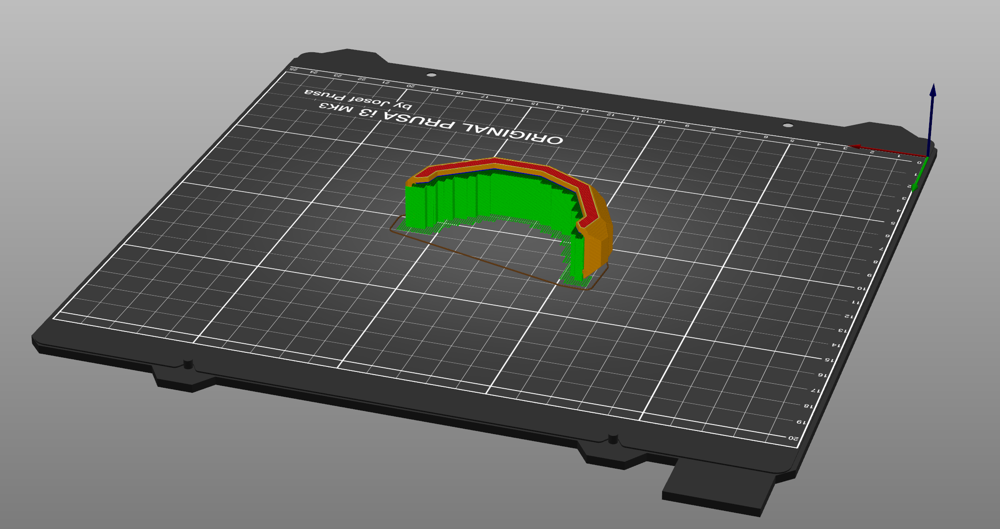

# HT-BumperGuards
Printable BumperGuards for the motor mounts of Lacroix Boards Hypertrucks.

VEGGY = Skinny version. 2mm thickness. 

BEEFY = Extra rotund version, approx 3-3.5mm thickness. 

## Printing notes:
Currently test-printing in TPU & Nylon. These are tight-fit with exact width measurements, depending on printer settings you may need to scale by 0.5-1%. 

Printed @ 100% infill, model needs to be flipped 180 for larger side to face platform down. 

Attached to motor mount using strip of VHB along inner channel. Keep it simple.
